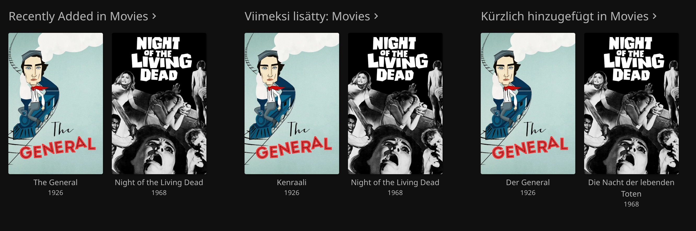
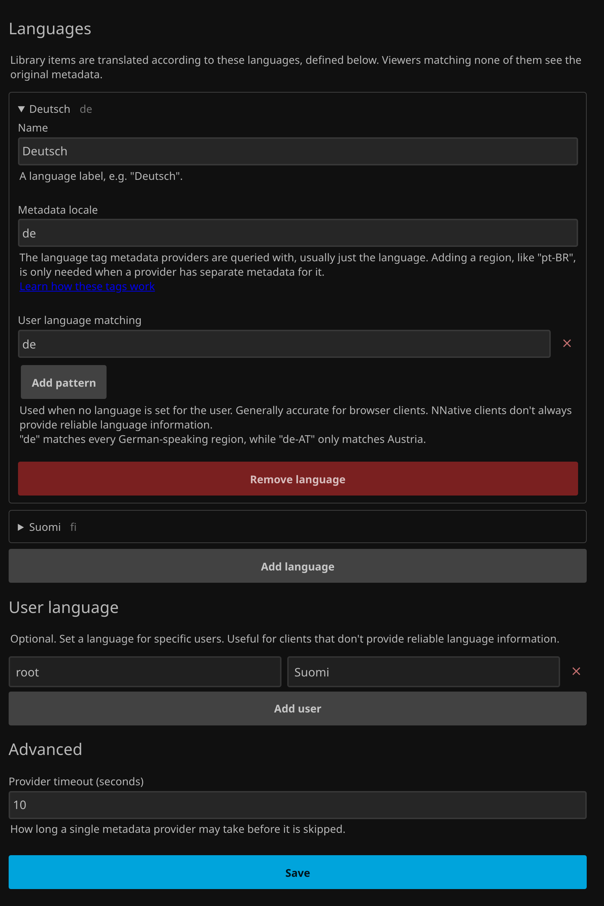

# Polyfin

[](https://github.com/elhlab/jellyfin-plugin-polyfin/actions/workflows/build.yaml)
[](https://github.com/elhlab/jellyfin-plugin-polyfin/actions/workflows/test.yaml)

[](https://jellyfin.org)
[](https://dotnet.microsoft.com)
[](LICENSE)

Polyfin fetches and stores metadata in the languages you configure, so users can share one Jellyfin library while each seeing metadata in their own language.




## What it does

This project is currently a work in progress. The core is implemented and works with movies, but it still has a decent journey to go before a release is published, and after that there's still more to add.

| Translated | Movies | Shows | Episodes |
| --- | :---: | :---: | :---: |
| Title | ✅ | 🚧 | 🚧 |
| Description | ✅ | 🚧 | 🚧 |
| Tagline | 🚧 | 🚧 | — |
| Season name | — | 🚧 | — |
| Library name | 🚧 | 🚧 | — |
| Posters | 🚧 | 🚧 | — |
| Genres, studios, tags | ❌ | ❌ | ❌ |
| Search and sort | ❌ | ❌ | ❌ |

| Clients | Web | Native apps |
| --- | :---: | :---: |
| Shows translated metadata | ✅ | ✅ |
| Language set per user by the admin | ✅ | ✅ |
| Language detected automatically | ✅ | ❌ |
| Language picked by the user | 🚧 | 🚧\* |

\* Chosen in the web UI, then applies in every app.

✅ Works &emsp; 🚧 Planned &emsp; ❌ Not supported

See the [roadmap](#roadmap) for what's planned next.


## How it works, and why

Polyfin intercepts Jellyfin's item responses and replaces the metadata after Jellyfin has built the response, before it's sent to the client. Metadata is fetched in the background through Jellyfin's own metadata providers and stored in an SQLite database, where requests are served from. Your library's own metadata isn't changed, so removing the plugin returns everything to how it was.

While Jellyfin supports multiple interface languages, the library metadata is stuck in one language. This project actually started as a transparent HTTP proxy written in Python ([archived here](https://github.com/elhlab/polyfin-proxy)), but during development I realised that a plugin might be a perfect fit for this. After a quick proof of concept I made the decision to switch to a plugin.

It should be noted that there is a reason Jellyfin has not done this. It would be a very large change that touches a lot of Jellyfin's internals. So why can a plugin do it? A plugin works on top of Jellyfin and can live with some gaps, especially the niche ones (see the [feature tables](#what-it-does)). Jellyfin itself would have to fix them all.


## Alternatives

### Polyglot

[Polyglot](https://github.com/Maronato/jellyfin-plugin-polyglot) takes a different approach. It creates a mirror library for each language, with hardlinks to the same media files, and each mirror gets its own metadata in that language. Users only see the libraries in their language. If you need multi-language metadata right now, it's probably the better choice.

The tradeoff is that every language is its own library with its own scans, and the mirrors have to be on the same filesystem as the media. Polyfin keeps one library and only changes what each client is shown.


## Getting started

There is no release yet, so for now the plugin has to be built from source and installed manually.

### Requirements

- [.NET 10 SDK](https://learn.microsoft.com/dotnet/core/install/)
- Jellyfin 12.0 or newer

### Build from source

```sh
git clone https://github.com/elhlab/jellyfin-plugin-polyfin.git
cd jellyfin-plugin-polyfin
dotnet build -c Release
```

The plugin ends up in `Jellyfin.Plugin.Polyfin/bin/Release/net10.0/Jellyfin.Plugin.Polyfin.dll`.

### Install on a Jellyfin server

Jellyfin loads plugins from the `plugins` folder in its data directory (`/config/plugins` in the official Docker image). Create a folder called `Polyfin` there, put `Jellyfin.Plugin.Polyfin.dll` in it and restart Jellyfin. The DLL is all that's needed.

The plugin's page will show "An error occurred while getting the plugin details from the repository". That's expected, as it isn't installed from a repository.

### Configuration

The settings page is under Dashboard → Plugins → Polyfin → Settings.



Languages are the metadata languages you offer. If no languages are configured, the plugin does nothing. Each language has a metadata locale, which is the locale the metadata is fetched in.

User language matching is a list of locales that map to this language. This mostly works for browser clients, as they are the only ones that send reliable `Accept-Language` headers. For native clients you can also set a user language, to force a user to always use that language.

The library is scanned nightly, or whenever you run the Refresh Metadata task (Dashboard → Scheduled Tasks → Polyfin), and any missing metadata is fetched. Already stored metadata isn't refreshed yet.

If no metadata is found for the user's configured language, the plugin won't modify the response and the library's default is returned. For this reason it is recommended to keep your library in a standard language. English is a good choice for this.

### Troubleshooting

#### Why is a title not in the intended language?

- **The item isn't matched to a provider.** An unidentified movie has nothing to look up.
- **A locale tag is misspelled.** Happens to the best of us.
- **The same locale tag is listed under two languages.** It is ignored for both.


## Roadmap

### Soon

- [ ] Translated taglines (small)
- [ ] Re-fetch partial metadata after some time (medium)
- [ ] Admin configured library names (medium)

### Later

- [ ] Series metadata (large)
- [ ] User selectable locale (large)
- [ ] Default language set to a configured language (e.g. Deutsch) instead of the library's own (medium)
- [ ] Localized posters (large)
- [ ] Explore spoofing the default audio track based on user locale (unknown)

### When I get to them

- [ ] Clean up metadata via a scan and an event handler (medium)
- [ ] Skip refetching when an item update didn't change its match (medium)
- [ ] Settings page hint: new languages are fetched on the next scheduled refresh (small)
- [ ] Advanced settings: worker count and wait interval (medium)
- [ ] Smoke-test script against the dev Jellyfin (large)
- [ ] Better test coverage (large)


## Development

### Dev server

You can start up a Jellyfin instance with the provided Docker Compose file to test directly. This builds the plugin and offers to (re)start the container with it:

```sh
./scripts/build-dev-plugin.sh
```

Needs Docker. It runs on http://localhost:8096 with a fake library from `scripts/seed-media.sh`. On the first start, go through Jellyfin's setup wizard and add `/media/movies` and `/media/series` as libraries.

`scripts/dev-logs.sh` can be used to show the log lines related to the plugin.

### Tests

Tests use xUnit and don't need a running Jellyfin:

```sh
dotnet test
```

CI builds, tests and runs CodeQL on every push to main and every pull request.

### Project structure

- `docs/`: docs and images.
- `scripts/`: dev scripts.
- `Jellyfin.Plugin.Polyfin.Tests/`: tests. Currently all in a flat directory, might change in the future. Fixtures go in `Fixtures/`.
- `Jellyfin.Plugin.Polyfin/`: plugin code.
  - `Configuration/`: settings model and the settings page.
  - `Database/`: SQLite metadata store and migration runner.
  - `Filters/`: response filter that swaps in stored metadata.
  - `Models/`: locales, languages and metadata records.
  - `Services/`: language matching, fetching and background refresh.
  - `Tasks/`: nightly metadata refresh.
  - `Transformers/`: apply metadata per item type (movies for now).


## AI disclosure

*As is tradition with Jellyfin plugins, here is your AI disclosure :)*

This project was bootstrapped with AI, after which a more assisted workflow was used. AI was used to generate a quick proof of concept (see the commits), after which I started iterating on top of it, building the project into something (hopefully) more robust. It should be noted that even though I have programming experience, I had none with C#, so while I have been managing and writing the more standard logic, certain C#-specific quirks were done by AI and I can't fully vouch for them being the best choice.

## License

GPL-3.0, kept from the Jellyfin plugin template. Jellyfin itself is GPL-licensed and plugins are loaded into it, so a GPL license keeps things consistent.
